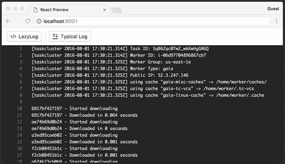

# React Lazylog

React components that load and view remote text in the browser lazily and efficiently.



## Features

- Efficient scrolling performance thanks to [react-virtualized](https://github.com/bvaughn/react-virtualized)
- Able to load large files upwards of 100MB without crashing the browser
- Parses, colorizes, and styles ANSI escapes within content
- Supports remote text files as well as chunked/streamed responses
- Line highlighting
- Customizable styling
- Works in latest browser versions, including iOS Safari and Android Chrome

## Getting started

You can install `react-lazylog` via Yarn or npm:

```bash
# If using Yarn:
yarn add react-lazylog

# If using npm:
npm install --save react-lazylog
```

The core components from react-lazylog are `LazyLog` and `LazyStream`. There is also a higher-order component (HOC) for
following logs until scroll. This module can be required via ES imports, CommonJS require, or UMD.

```js
import { LazyLog, LazyStream, ScrollFollow } from 'react-lazylog';

// full list of components
import {
  LazyLog,
  LazyStream,
  LazyList,
  ScrollFollow,
  Line,
  LineContent,
  LineNumber,
  LinePart,
  Loading,
  Spinner
} from 'react-lazylog';

// using require
const { LazyLog, LazyStream, ScrollFollow } = require('react-lazylog');
```

_`LazyLog` and `LazyStream` inherit from `LazyList`._

## `<LazyLog />` & `<LazyStream />`

### Usage

After importing a component, it can be rendered with the required `url` prop:

```jsx
import React from 'react';
import { render } from 'react-dom';
import { LazyLog } from 'react-lazylog';

render((
  <LazyLog url="http://example.log" />
), document.getElementById('root'));
```

By default the `LazyLog` will expand to fill its container, so ensure this container has valid dimensions and layout.
If you wish to have fixed dimensions, change the `height` and `width` props.

If you are going to be rendering a complete file, or an endpoint which can be downloaded all at once, use the
`<LazyLog />` component for better overall performance at the expense of slightly longer upfront load time.

If you are going to be requesting a streaming or chunked response, use the `<LazyStream />` component for
quicker upfront rendering as content can be decoded as it arrives.

### Props

`LazyLog` and `LazyStream` accept various common props to customize their behavior:

| Property | Type | Required? | Description |
|:---|:---|:---:|:---|
| `url` | String | ✓ | The URL from which to fetch content. Subject to same-origin policy, so must be accessible via fetch on same domain or via CORS. |
| `fetchOptions` | Object |  | Options object which will be passed through to the `fetch` request. Defaults to `{ credentials: 'omit' }`. |
| `height` | Number or `'auto'` |  | Set the height in pixels for the component. Defaults to `'auto'` if unspecified. When the `height` is `'auto'`, the component will expand vertically to fill its container. |
| `width` | Number or `'auto'` |  | Set the width in pixels for the component. Defaults to `'auto'` if unspecified. When the `width` is `'auto'`, the component will expand horizontally to fill its container. |
| `highlight` | Number or Array |  | Line number (e.g. `highlight={10}`) or line number range to highlight inclusively (e.g. `highlight={[5, 10]}` highlights lines 5-10). This is 1-indexed, i.e. line numbers start at `1`. |
| `scrollToLine` | Number |  | Scroll to a particular line number once it has loaded. This is 1-indexed, i.e. line numbers start at `1`. Cannot be used in combination with `follow`. |
| `follow` | Boolean |  | Scroll to the end of the component after each update to the content. Cannot be used in combination with `scrollToLine`. |
| `formatPart` | Function |  | Execute a function against each string part of a line, returning a new line part. Is passed a single argument which is the string part to manipulate, should return a new string with the manipulation completed. |
| `onLoad` | Function |  | Execute a function if/when the provided `url` has completed loading. |
| `onError` | Function |  | Execute a function if the provided `url` has encountered an error during loading. |
| `onHighlight` | Function |  | Execute a function when the highlighted range has changed. Is passed a single argument which is an `Immutable.Range` of the highlighted line numbers. |
| `style` | Object |  | Optional custom inline style to attach to root virtual `LazyList` element. |
| `containerStyle` | Object |  | Optional custom inline style to attach to element which contains the interior scrolling container. |

In addition, most of the properties available to [react-virtualized List](https://github.com/bvaughn/react-virtualized/blob/master/docs/List.md)
can be provided and will be passed through to the component. _Here are a few useful props:_

| Property | Type | Required? | Description |
|:---|:---|:---:|:---|
| `rowHeight` | Number |  | A fixed row height in pixels. Controls how tall a line is, as well as the `lineHeight` style of the line's text. Defaults to `19`. |
| `overscanRowCount` | Number |  | Number of rows to render above/below the visible bounds of the list. This can help reduce flickering during scrolling on certain browsers/devices. Defaults to `100`. |
| `scrollToAlignment` | String |  | Controls the alignment of scrolled-to-rows. The default (`'auto'`) scrolls the least amount possible to ensure that the specified row is fully visible. Use `'start'` to always align rows to the top of the list and `'end'` to align them bottom. Use `'center'` to align them in the middle of container. |
| `onScroll` | Function |  | Callback invoked whenever the scroll offset changes within the inner scrollable region: `({ clientHeight: number, scrollHeight: number, scrollTop: number }): void` |

## `<ScrollFollow />`

`ScrollFollow` is a higher-order component (HOC) that aims to simplify toggling a `LazyLog`'s or `LazyStream`'s
"follow" functionality based on user scrolling.

### Usage

The `ScrollFollow` component accepts a function-as-child prop which should return a component to render based on the
function's arguments.

```jsx
import React from 'react';
import { render } from 'react-dom';
import { LazyLog, ScrollFollow } from 'react-lazylog';

render((
  <ScrollFollow startFollowing={true}>
    {({ follow, onScroll }) => (
      <LazyLog url="http://example.log" follow={follow} onScroll={onScroll} />
    )}
  </ScrollFollow>
), document.getElementById('root'));
```

### Props

| Property | Type | Required? | Description |
|:---|:---|:---:|:---|
| `startFollowing` | Boolean |  | The initial follow action; defaults to `false`. The value provided here will inform the initial `follow` property passed to the child function. |

### Child Function Properties

The child function passed to `ScrollFollow` is passed a single argument, an object with the following properties:

| Property | Type | Description |
|:---|:---|:---|
| `follow` | Boolean | This value is `true` or `false` based on whether the component should be auto-following. This value can be passed directly to the Lazy component's `follow` prop. |
| `onScroll` | Function | This function is used to listen for scrolling events and turn off auto-following (`follow`). This value can be passed directly to the Lazy component's `onScroll` prop. |
| `startFollowing` | Function | A helper function for manually re-starting `follow`ing. Is not used by a Lazy component; rather this can be invoked whenever you need to turn back on auto-following, but cannot reliably do this from the `startFollowing` prop. e.g `startFollowing();` |
| `stopFollowing` | Function | A helper function for manually stopping `follow`ing. Is not used by a Lazy component; rather this can be invoked whenever you need to turn off auto-following, but cannot reliably do this from the `startFollowing` prop. e.g `stopFollowing();` |

```jsx
<ScrollFollow>
{({ onScroll, follow, startFollowing, stopFollowing }) => (
  <LazyLog url={'...'} onScroll={onScroll} follow={follow} />
)}
</ScrollFollow>
```

## Styling

All of the components exposed from react-lazylog use CSS modules to contain its styles to each individual component. If
you wish to override these styles, there are a few techniques you can use.

### `style` and `containerStyle`

For the core container of `<LazyLog />` and `<LazyStream />`, you can pass a `style` object prop to affect many styles.
For affecting the look or behavior of the scrollable region of these components, use the `containerStyle` prop with a
styling object.

### `defaultProps.style`

For many react-logviewer components, continually passing varied styling objects is tedious. To make this simpler, you can
override the `defaultProps.style` of any desired component to override styles of that component. For example:

```jsx
// full list of components
import {
  Line,
  LineContent,
  LineNumber,
  LinePart,
  Loading,
  Spinner
} from 'react-lazylog';

// Use defaultProps.style to set the style for an internal component
Line.defaultProps.style = {
  color: 'green'
};
```

**Note: overriding the ANSI colors and styles is currently undocumented, and will probably need some source-diving to
figure out. I would gladly accept a pull request that could improve the styling API.**

### CSS stylesheets

If you are using CSS stylesheets, you can target the main virtual `LazyList` component with the `react-lazylog`
class name. From there you can target the individual `div` lines, `a` line numbers, or `span` line content.

## Sub-components

react-lazylog uses a number of sub-components internally to render individual parts of the log-viewing component:

### `<Line />`

A single row of content, containing both the line number and any text content within the line.

### `<LineNumber />`

The line number of a single line. The anchor contained within is interactive, and will highlight the entire line upon
selection.

### `<LineContent />`

The container of all the individual pieces of content that is on a single line. May contain one or more `LinePart`s
depending on ANSI parsing.

### `<LinePart />`

An individual segment of text within a line. When the text content is ANSI-parsed, each boundary is placed within its
own `LinePart` and styled separately (colors, text formatting, etc.) from the rest of the line's content.

## Technology

- [React Virtualized](https://github.com/bvaughn/react-virtualized) for efficiently rendering large lines of data
- [Neutrino](https://neutrino.js.org) for building and developing using shared presets and Webpack
- [neutrino-preset-react-components](https://github.com/eliperelman/neutrino-preset-react-components/) for creating and previewing React components
- [PM2](http://pm2.keymetrics.io/) for process management during development
- `fetch` API for efficiently requesting data with array buffers and binary streams
  - [fetch-readablestream](https://github.com/jonnyreeves/fetch-readablestream/)
  - [web-streams-polyfill](https://www.npmjs.com/package/web-streams-polyfill)
  - [text-encoding-utf-8](https://www.npmjs.com/package/text-encoding-utf-8)
- [ansiparse](https://www.npmjs.com/package/ansiparse) for nice log styling, like Travis
- [mitt](https://www.npmjs.com/package/mitt) for dead-simple events to manage streaming lifecycle
- [Immutable](https://www.npmjs.com/package/immutable) for efficiently storing and managing very large collections of lines and highlight ranges
- `Uint8Array` for dealing with text content as binary, allows for conditionally rendering partial data and decoding everything without crashing your browser

## Development and Contributing

This repository uses [Neutrino](https://neutrino.js.org) and [neutrino-preset-react-components](https://github.com/eliperelman/neutrino-preset-react-components/)
for developing, previewing, and building React components. To get started:

- Fork and clone this repo.
- Install the dependencies with `yarn`.
- Start the development servers with `yarn start`. This will launch a PM2 instance of webpack-dev-server and a Node.js server.
Open a browser to http://localhost:9001 to preview the React components.
- Use CTRL-C to exit the PM2 server monitoring.
- Use `yarn stop` to stop the development servers.
- Use `yarn build` to generate the compiled component for publishing to npm.

Feel free to open an issue, submit a pull request, or contribute however you would like. Understand that this
documentation is still a work in progress, so file an issue or submit a PR to ask questions or make improvements.
Thanks!
